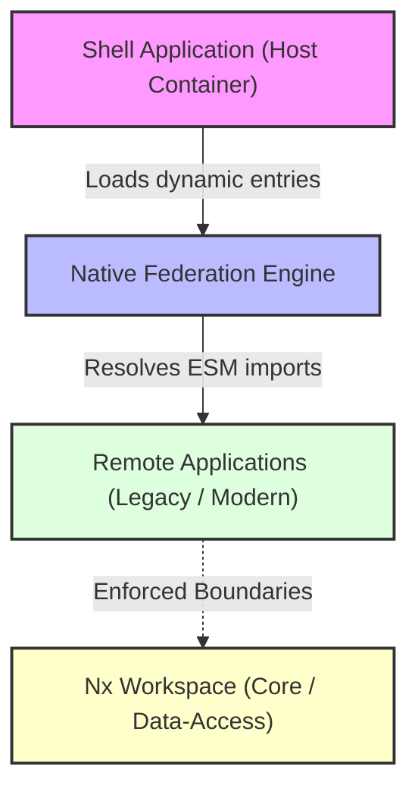

# Enterprise Angular Architecture Reference

## Overview
**GovPortal** is an enterprise **reference architecture** designed to demonstrate a modular, scalable and secure **enterprise frontend migration** path for public sector portals. 

- **Problema arquitectónico**: Los portales gubernamentales tradicionales sufren de rigidez de despliegue, fallas en cascada y una estrecha dependencia entre equipos. Compilar un monolito de frontend masivo incrementa exponencialmente el riesgo y los tiempos de entrega.
- **Objetivo**: Desarrollar una **modular architecture** desacoplada que permita a equipos independientes compilar, probar y desplegar verticales de negocio sin afectar la aplicación Shell host principal.
- **Valor técnico**: Integrar microfrontends en runtime de manera nativa (sin ataduras de empaquetadores como Webpack) y gobernar el flujo de datos mediante límites estrictos de dependencias estáticas en un monorreferencial.

## Architecture Overview

La plataforma implementa el patrón **Shell-Microfrontend** donde el Host inicializa y carga dinámicamente las vistas remotas mediante estándares del navegador (ESM).

### Responsabilidades
1.  **Shell Application (Host)**: Punto de entrada único. Maneja la sesión del usuario, define el enrutamiento global e inyecta la hoja de estilos compartida.
2.  **Native Federation**: Engine en caliente que actúa sobre Import Maps nativos en el navegador, resolviendo qué chunks de código descargar de forma diferida.
3.  **Remote Applications**:
    *   `legacy`: Módulo remoto simulando la migración progresiva.
    *   `modern`: Módulo remoto aplicando reactividad fina y componentes standalone modernos.
4.  **Nx Workspace**: Gobierna la base de código local, forzando límites de imports e impidiendo dependencias circulares.

### Comunicación
La comunicación inter-MFE está estrictamente desacoplada a través del enrutador de Angular. Los remotos exponen puntos de entrada aislados (`./Routes`) y no comparten estado mutable de forma directa.

### Límites
Establecidos mediante la regla `@nx/enforce-module-boundaries` de ESLint, impidiendo que los remotos interactúen de forma cruzada o importen directamente archivos internos del Host.

---

## Architecture Decisions

Las decisiones de diseño técnico y sus justificaciones formales se encuentran en la carpeta [docs/adr](file:///mnt/data/lrangela-repos/govportal/docs/adr):

### [ADR-001 Native Federation](file:///mnt/data/lrangela-repos/govportal/docs/adr/0001-native-federation.md)
*   **Context**: Webpack Module Federation acopla el ecosistema a Webpack, imposibilitando el uso de compiladores rápidos como esbuild o Vite.
*   **Decision**: Adoptar Native Federation (basado en ESM e Import Maps nativos).
*   **Why**: Desacoplar el empaquetado del runtime para acelerar la velocidad del pipeline local y de CI.
*   **Trade-offs**: Requiere de shims en tiempo de ejecución (`es-module-shims`) para navegadores heredados que carezcan de soporte para import maps nativos.

### [ADR-002 Nx Monorepo](file:///mnt/data/lrangela-repos/govportal/docs/adr/0002-nx-monorepo.md)
*   **Context**: Múltiples repositorios aislados para frontend duplican librerías core y provocan desalineaciones de APIs.
*   **Decision**: Unificar en un monorepo Nx para forzar límites estáticos de dependencias de negocio.
*   **Benefits**: Compilaciones incrementales aceleradas (`nx affected`) y consistencia en los estándares de calidad de código de los equipos.
*   **Limitations**: Curva de aprendizaje técnica y mayor complejidad en la gobernanza de refactorizaciones de librerías core transversales.

### [ADR-003 Angular Signals](file:///mnt/data/lrangela-repos/govportal/docs/adr/0003-angular-signals.md)
*   **Context**: Change Detection implícito de Zone.js degrada la performance en interfaces de alta densidad de datos.
*   **Decision**: Utilizar Angular Signals y `@ngrx/signals` para la gestión de estado de dominio.
*   **Performance considerations**: Cambios dirigidos al DOM sin re-renderizar componentes superiores y compatibilidad directa con change detection Zoneless.
*   **Trade-offs**: Requiere interoperabilidad manual con flujos RxJS (`toSignal`/`toObservable`).

### [ADR-004 Standalone Components](file:///mnt/data/lrangela-repos/govportal/docs/adr/0004-standalone-components.md)
*   **Context**: Los módulos NgModules acoplan componentes y servicios de forma indirecta, complicando el tree-shaking del compilador.
*   **Decision**: Utilizar Standalone Components en todo el monorepo.
*   **Benefits**: Componentes autocontenidos declarando de forma explícita sus dependencias en `@Component.imports`.
*   **Trade-offs**: Incrementa marginalmente la verbosidad en los archivos individuales al tener que importar utilidades comunes.

---

## Engineering Practices

- **Code organization**: Estructuración estricta dividiendo aplicaciones ejecutables (`apps/`) de librerías comunes y de dominio (`libs/`).
- **Dependency boundaries**: Control estricto de accesos cruzados configurados en `tsconfig.base.json` y validados por el linter de Nx.
- **Testing strategy**:
  *   *Unit Testing*: Pruebas de lógica y servicios con Vitest y SWC.
  *   *E2E Testing*: Pruebas de integración funcional entre la Shell y remotos mediante Playwright.
- **CI/CD**: GitHub Actions configurado para compilar y validar únicamente los proyectos que sufrieron modificaciones en el grafo (`nx affected`).

---

## Performance

- **Lazy Loading**: Enrutamiento diferido configurado de manera nativa para evitar descargas innecesarias en el primer renderizado.
- **Zoneless**: Desactivación progresiva del rastreo automático de Zone.js (`provideZonelessChangeDetection()`) en las aplicaciones.
- **Signals**: Renderizado síncrono localizado en plantillas.
- **Bundle optimization**: Compartición de runtimes core (`@angular/core`, `rxjs`) a nivel deNative Federation para evitar bundles duplicados.

### Recommended measurements
*Pendiente de implementación o evidencia* (Es necesario integrar telemetría de Core Web Vitals como LCP, TBT y CLS en producción para medir el impacto de la hidratación diferida de microfrontends).

---

## Security
*Pendiente de implementación o evidencia* (Se deben documentar las políticas de seguridad dinámica CSP y el flujo de propagación segura de cabeceras de autorización JWT en llamadas de red inter-MFE).

---

## Testing Strategy
- **Unit testing**: Pruebas unitarias sobre las librerías `@gov/core` y `@gov/data-access` utilizando Vitest.
- **E2E**: Pruebas sobre la navegación y persistencia simulada entre remotos e iframe wrappers utilizando Playwright.

---

## CI/CD
El pipeline de integración continua corre sobre GitHub Actions utilizando el motor de Nx.
1. `npm run lint`: Validación de fronteras mediante ESLint.
2. `npm run test`: Pruebas unitarias de subsegundo de Vitest.
3. `npm run build`: Compilación de producción incremental de los remotos y la shell.

## Deployment
La entrega continua está automatizada en GitHub Actions (`ci.yml`) y se activa en cada push a la rama `main`. El flujo ejecuta un despliegue estático sobre **GitHub Pages**:

1.  **Compilación Dinámica**: Compila el host `shell` y los remotos (`legacy-remote`, `modern-remote`) usando perfiles de producción.
2.  **Ensamblado del Sitio (Staging)**: Consolida los bundles compilados dentro de un único directorio de salida (`out/`), anidando los remotos en `out/legacy/` y `out/modern/`.
3.  **Patching en Runtime de Native Federation**: Ejecuta un script en Node.js que reescribe `out/federation.manifest.json` para alinear las referencias de carga a rutas relativas (`./legacy/remoteEntry.json`).
4.  **Ajuste de Base Href**: Modifica el tag `<base href>` en todos los archivos `index.html` generados para coincidir con la subruta del repositorio gubernamental.
5.  **Mock API Export**: Genera una exportación estática de la base de datos simulada en formato JSON para eliminar la necesidad de un servidor backend activo.
6.  **Soporte SPA (404 Fallback)**: Duplica el archivo `index.html` como `404.html` en las raíces correspondientes para asegurar que el enrutamiento interno de Angular funcione sin errores 404 al recargar el navegador en hosts estáticos.

---

## Release: v1.0.0
### Enterprise Angular Architecture Reference
Esta primera versión estable del repositorio consolida los siguientes estándares técnicos:
- Workspace de Nx estructurado con fronteras estáticas.
- Orquestación en runtime mediante Native Federation.
- Gestión de estado basada en Angular Signals.
- Documentación formal de decisiones arquitectónicas (ADRs).
- Pipeline optimizado de CI/CD en GitHub Actions.
