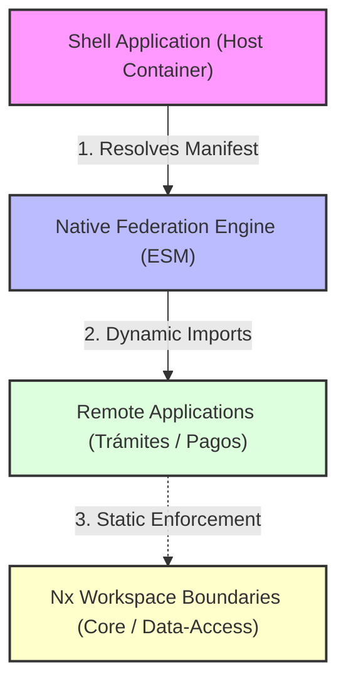

# Enterprise Angular Architecture Reference

## Overview
**GovPortal** es una plataforma GovTech a gran escala diseñada para resolver el problema de la rigidez, el acoplamiento y el riesgo de actualización en monolitos públicos gubernamentales. Tradicionalmente, los portales estatales sufren interrupciones en cascada y requieren compilaciones monolíticas completas para desplegar cambios menores. Esta solución permite la coexistencia y migración progresiva de aplicaciones heredadas (*Legacy*) a un estándar moderno sin interrumpir los servicios críticos de cara al ciudadano, posibilitando despliegues independientes por cada vertical de negocio (ej. Trámites, Pagos, Identidad).

- **Objetivo**: Diseñar una arquitectura federada que permita la coexistencia de módulos legacy y modernos, con compilaciones incrementales aisladas.
- **Problema arquitectónico**: Acoplamiento técnico en desarrollos distribuidos, fallas de despliegue en cascada y la rigidez de compilación de grandes aplicaciones de cara al ciudadano.
- **Valor técnico**: Implementación de Native Federation sobre estándares de navegadores (ESM), reduciendo a cero el acoplamiento con empaquetadores específicos (como Webpack).

## Architecture

El sistema utiliza un patrón de contenedor interactivo (**Shell-Microfrontend**) que carga módulos remotos en caliente utilizando Native Federation.

### Límites y Responsabilidades
1.  **Shell Application (Host)**: Orquesta la navegación, inicializa la federación a través del manifiesto dinámico, e implementa el control de estado global común de sesión.
2.  **Native Federation**: Actúa como el motor en runtime basado en estándares de navegadores para resolver la compartición de dependencias e importación de remotos.
3.  **Remote Applications**: Aplicaciones independientes que exponen sub-rutas específicas del negocio gubernamental.
4.  **Nx Workspace**: Gobierna los límites de importación estáticos mediante ESLint, asegurando que las librerías compartidas respeten el principio de inversión de dependencia.

### Comunicación
La comunicación se realiza mediante enrutamiento declarativo e inyección de dependencias configurada en la capa central del monorepo (`@gov/core`). No existe comunicación acoplada por eventos entre microfrontends remotos.

### Trade-offs
- **Ventaja**: Desacoplamiento total de equipos de desarrollo, reducción del tiempo de compilación mediante compilación incremental, e independencia de despliegue.
- **Trade-off**: Complejidad en la depuración local y la necesidad de manejar shims de ESM en navegadores heredados que carezcan de soporte para import maps nativos.

## Architecture Decisions

### ADR 001: Why Native Federation?
*   **Context**: Webpack Module Federation acopla fuertemente el pipeline de CI/CD al bundler Webpack, impidiendo migrar hacia motores de compilación rápidos como esbuild o Vite.
*   **Decision**: Adoptar Native Federation para gestionar la federación de módulos nativamente sobre ESM (EcmaScript Modules) e Import Maps.
*   **Benefits**: Independencia del bundler y compatibilidad futura con Vite y compiladores rápidos en Rust/Go.
*   **Trade-offs**: Requiere inyectar shims en tiempo de ejecución (`es-module-shims`) para navegadores antiguos, lo que añade una pequeña carga de red inicial.

### ADR 002: Why Nx Monorepo?
*   **Context**: Múltiples equipos desarrollando repositorios aislados generan desalineación de APIs, inconsistencia visual y duplicación de librerías comunes.
*   **Decision**: Centralizar el ecosistema en un monorepo Nx forzando límites de importación estáticos mediante ESLint.
*   **Benefits**: Reutilización efectiva de código del shared kernel y consistencia en los estándares de calidad locales.
*   **Trade-offs**: Curva de aprendizaje inicial para desarrolladores y configuración de pipelines más compleja que un proyecto individual.

### ADR 003: Why Angular Signals?
*   **Context**: Zone.js genera comprobaciones completas en el árbol de componentes (Change Detection) innecesariamente amplias, lo cual degrada la performance en aplicaciones GovTech con alta interactividad.
*   **Decision**: Implementar reactividad fina mediante Angular Signals en componentes de catálogo, permitiendo un enrutamiento más limpio y un estado predecible sin Zone.js.
*   **Benefits**: Incremento de performance de renderizado y mejor legibilidad del código sin sobreuso de subscripciones RxJS.
*   **Trade-offs**: Requiere de interoperabilidad manual (`toSignal`/`toObservable`) en integraciones heredadas basadas en RxJS.

### ADR 004: Why Standalone Components?
*   **Context**: Los módulos NgModules acoplan componentes y servicios de forma indirecta, dificultando el tree-shaking y complicando la carga perezosa en microfrontends remotos.
*   **Decision**: Forzar el uso de Standalone Components en todas las aplicaciones del monorepo.
*   **Benefits**: Componentes autocontenidos más fáciles de probar, migrar e importar independientemente en los microfrontends remotos.
*   **Trade-offs**: Requiere declarar imports de componentes comunes en cada archivo individual de componente, aumentando marginalmente la verbosidad en el código.

## Performance

- **Lazy Loading**: Todo el enrutamiento inter-MFE está configurado de manera diferida. La carga de código JS ocurre bajo demanda cuando el ciudadano navega al flujo correspondiente.
- **Bundle Optimization**: Las librerías core comunes como `@angular/core` y `rxjs` son marcadas como compartidas en el manifiesto de Native Federation, cargándose una sola vez en el host y evitando duplicación en el bundle de cliente.
- **Rendering Strategy**: Renderizado estático en el cliente con hidratación dinámica diferida de microfrontends remotos.
- **Métricas de Performance**: *Pendiente de implementación o evidencia* (Es necesario integrar herramientas de medición de Core Web Vitals en producción, documentando valores de LCP, FID y CLS reales del portal).

## Security

- **JWT Propagation**: *Pendiente de implementación o evidencia* (Inyección automática de tokens de autenticación federada en cabeceras de red mediante interceptores dedicados).
- **Dynamic Content Security Policy (CSP)**: *Pendiente de implementación o evidencia* (Políticas dinámicas para autorizar orígenes de scripts de microfrontends descargados en runtime).
- **Legacy Wrapper Sandbox**: Implementación de contenedores iframe con atributos sandbox restrictivos para aislar los flujos legados (AngularJS / jQuery) de scripts maliciosos.

## Testing Strategy

- **Unit Tests**: Ejecución rápida de pruebas unitarias sobre librerías compartidas con Vitest (v4.0) y SWC.
- **E2E Tests**: Suite de integración de extremo a extremo en Playwright para simular el enrutamiento e interacciones de usuarios entre la Shell y los microfrontends remotos en caliente.

## CI/CD
El pipeline en GitHub Actions aprovecha el grafo de dependencias de Nx.
1. `npm run lint`: Ejecuta auditoría estática sobre los archivos modificados.
2. `npm run test`: Corre las pruebas unitarias rápidas de los módulos afectados vía Vitest.
3. `npm run build`: Compila únicamente las aplicaciones y microfrontends que sufrieron modificaciones.

## Roadmap
- [ ] Implementar Server-Side Rendering (SSR) híbrido para portales informativos de acceso público que requieran SEO exhaustivo (Debe implementarse).
- [ ] Integrar telemetría de rendimiento automatizada por MFE usando métricas de Core Web Vitals en producción (Debe implementarse).
- [ ] Configurar inyección automatizada de cabeceras de seguridad dinámica en el interceptor de red centralizado (Debe implementarse).
