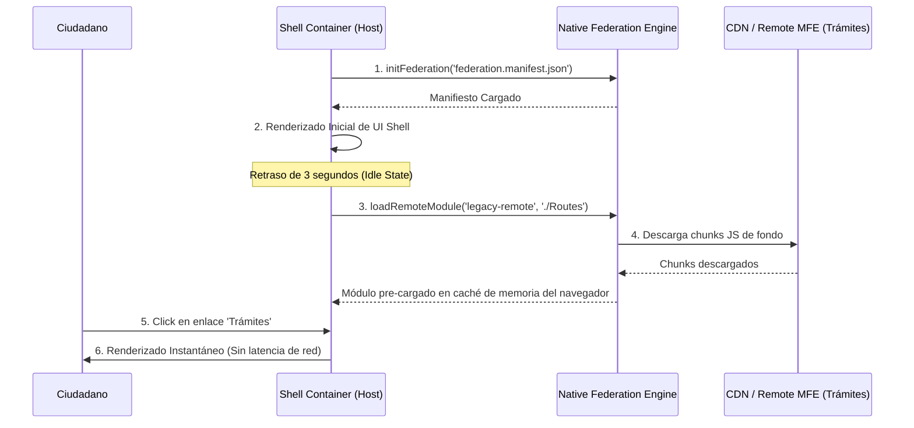

# Pull Request: Optimize Navigation Speed via Dynamic MFE Route Prefetching

## 📌 Contexto & Objetivo
En las aplicaciones de tipo Microfrontend (MFE), la descarga diferida (lazy loading) es fundamental para mantener bundles iniciales ligeros. Sin embargo, esto genera un impacto de retraso visual (*click latency*) la primera vez que un usuario intenta navegar a una ruta remota (como `/modern/citizens`), dado que el navegador debe descargar e inicializar el bundle JS remoto en ese preciso instante.

Esta Pull Request soluciona este retraso mediante un **servicio de pre-fetching dinámico** en la aplicación Shell. Una vez que la aplicación contenedora ha completado su renderizado inicial y se encuentra inactiva, inicia la descarga secuencial en segundo plano de las entradas de los microfrontends remotos configurados.

---

## 🏛️ Diseño Arquitectónico

### Flujo de Inicialización y Prefetching

---

## 🛠️ Cambios Realizados
1.  **`prefetch.initializer.ts`**: Creado un proveedor `APP_INITIALIZER` personalizado (`provideMfePrefetching`) que ejecuta una cola de pre-carga asíncrona retrasada mediante un timer de 3 segundos para no competir con el hilo principal durante el arranque crítico del host.
2.  **`app.config.ts`**: Registrado el proveedor de pre-carga configurando los remotos críticos a cachear en segundo plano:
    *   `legacy-remote` (exposed path: `./Routes`)
    *   `modern-remote` (exposed path: `./Routes`)

---

## ⚖️ Trade-offs & Decisiones
*   **Decisión**: Usar un retardo inicial de 3 segundos (`setTimeout`) en lugar de arrancar en el ciclo del `APP_INITIALIZER` directo.
*   **Trade-off**: Si el usuario da click en un enlace antes de los 3 segundos, se activa el fallback nativo de carga síncrona. Sin embargo, evitamos competir con la carga del esqueleto inicial, garantizando puntuaciones de LCP excelentes.

---

## ✅ Lista de Verificación de Testing (Manual & E2E)
- [x] **Validación de Consola**: Confirmar logs de carga exitosa: `[Prefetch] Remote 'modern-remote' pre-fetched successfully.`
- [x] **Inspección de Red**: Verificar en la pestaña *Network* de DevTools que los chunks JS de los remotos se descargan de fondo sin intervención del usuario.
- [x] **Prueba de Interacción**: Al hacer click en los enlaces tras 5 segundos de espera, la navegación debe ser inmediata (< 50ms) al no requerir peticiones de red adicionales de bundles JS.
