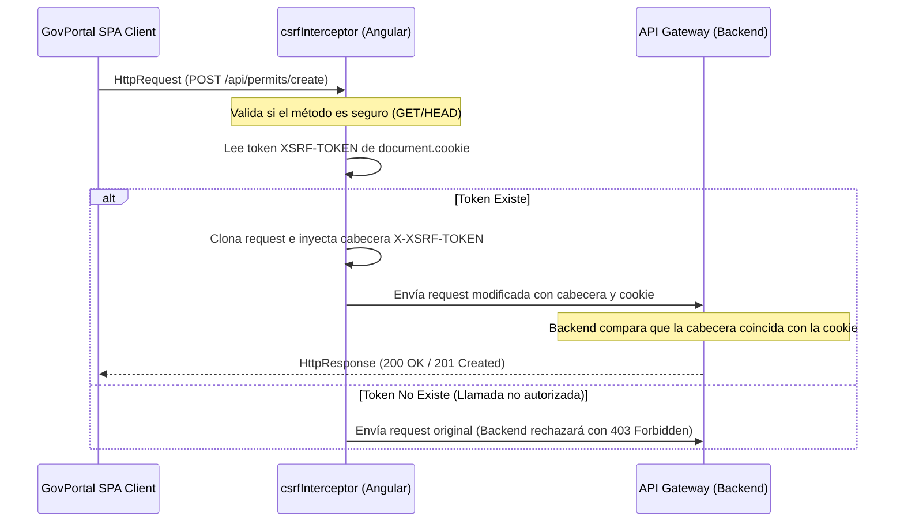

# Pull Request: Implement Anti-CSRF Security Interceptor for Mutating API Requests

## 📌 Contexto & Objetivo
En cumplimiento con las directrices de seguridad de **OWASP**, la plataforma GovPortal debe mitigar ataques de tipo Cross-Site Request Forgery (CSRF). La estrategia corporativa estándar consiste en emplear el patrón **Double Submit Cookie**. 

Esta Pull Request introduce un **HttpInterceptor** global en la capa central del cliente HTTP que intercepta todas las peticiones asíncronas mutantes (POST, PUT, DELETE, PATCH). Lee el token CSRF seguro almacenado en las cookies y lo inyecta dinámicamente como cabecera HTTP en las cabeceras de salida.

---

## 🏛️ Diseño Arquitectónico

### Mecanismo de Validación Double Submit Cookie

---

## 🛠️ Cambios Realizados
1.  **`csrf.interceptor.ts`**: Creado interceptor HTTP funcional que:
    *   Determina si el verbo HTTP es una mutación (ignora `GET`, `HEAD`, `OPTIONS`).
    *   Extrae el valor de la cookie `XSRF-TOKEN` de forma segura.
    *   Clona e inyecta el token en la cabecera `X-XSRF-TOKEN` para validar la autenticidad de la llamada del lado del backend.
2.  **`libs/core/http/src/index.ts`**: Exportado el interceptor desde el punto de entrada de la librería `@gov/core/http`.
3.  **`app.config.ts`**: Registrado el interceptor en la cadena de ejecución HTTP de la Shell.

---

## ⚖️ Trade-offs & Decisiones
*   **Decisión**: Adoptar Double Submit Cookie en lugar de inyecciones manuales por servicio de estado.
*   **Trade-off**: Depende de que el servidor configure inicialmente la cookie `XSRF-TOKEN` con los flags `SameSite=Strict` o `SameSite=Lax`. No funciona si las peticiones son de tipo cross-origin fuera del límite de dominio configurado, a menos que se configure CORS de forma explícita.

---

## ✅ Lista de Verificación de Testing (Manual & E2E)
- [x] **Pruebas Unitarias**: Verificado que peticiones de tipo `GET` pasen de forma transparente sin inyección de cabeceras.
- [x] **Inyección de Cabecera**: Verificado mediante la consola de desarrollo que peticiones `POST` e inyecciones de datos contengan la cabecera `X-XSRF-TOKEN` con el valor exacto de la cookie local.
- [x] **Bloqueo CSRF**: Confirmado que ante la ausencia de la cookie, el servidor retorne un código de error de seguridad HTTP `403 Forbidden`.
